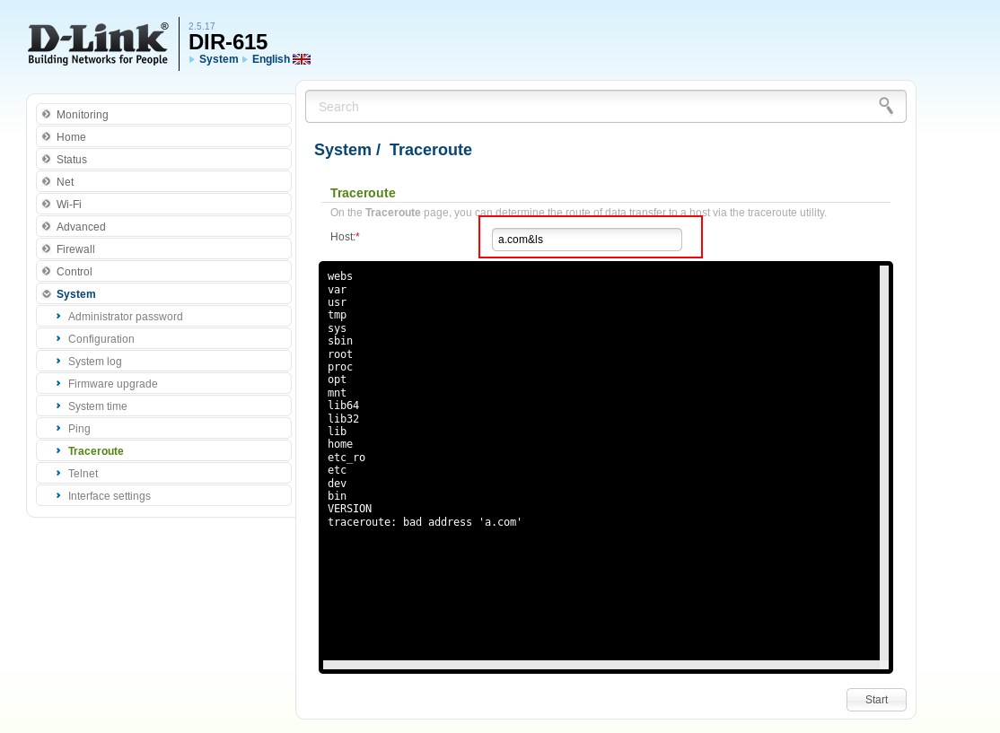

# D-Link DIR-615 Remote Code Execution #

**vender** ：D-Link Russia

**Firmware version**:2.5.17

**Exploit Author**: sebao@knownsec

**Vendor Homepage**: http://www.dlink.ru

**Hardware Link**:http://dlink.ru/ru/products/5/2067_d.html

## Vul detail ##

Reproduction Steps:

1. Go to your wi-fi router gateway [i.e: http://192.168.0.1]
1.login with admin 
1. Go to –> “System” –> “Traceroute”
1. Set host "a.com&ls"
1. Start Traceroute

