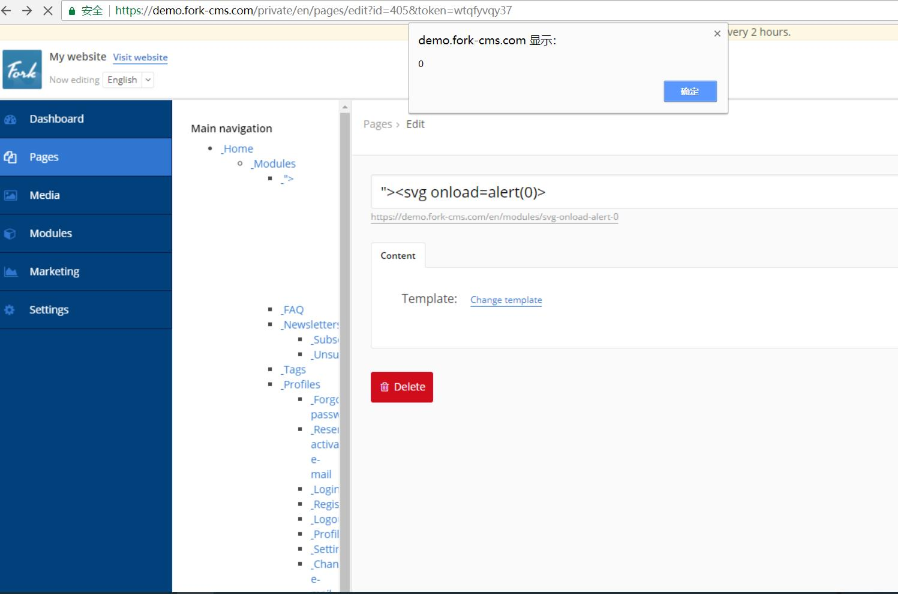

CVE-2018-5215
forkcms has XSS via the /private/en/pages/edit title parameter. 

login to adminpage and edit pages.
In title parameter input xss payload `"><svg onload=alert(0)>`,then save page edit there is xss vul in pages page
