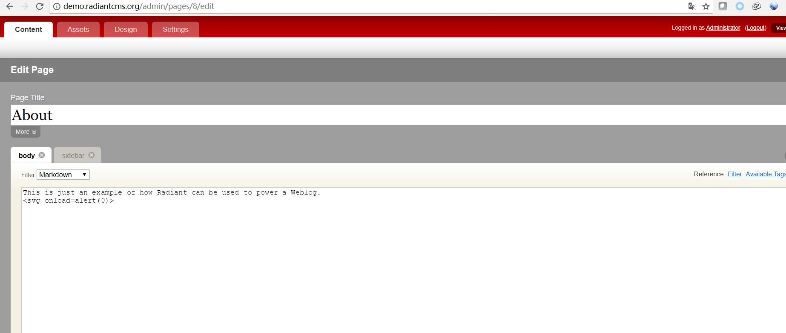
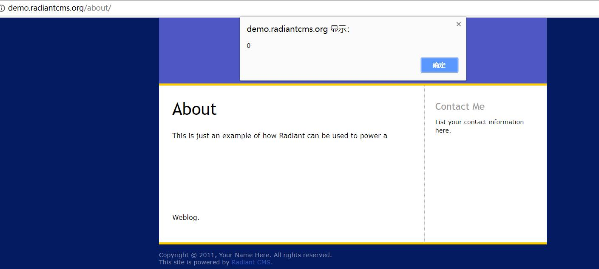

# radiantcms xss vul #
CVE-2018-5215
login demo site http://demo.radiantcms.org/admin/
Username: admin
Password: radiant
 and in content edit page .for example Edit About page and in body input xss payload `<svg onload=alert(0)>`,and select Filter as Markdown,then save it edit.

and visite http://demo.radiantcms.org/about/ there is a alert box 

