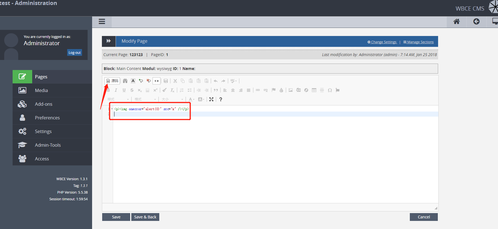
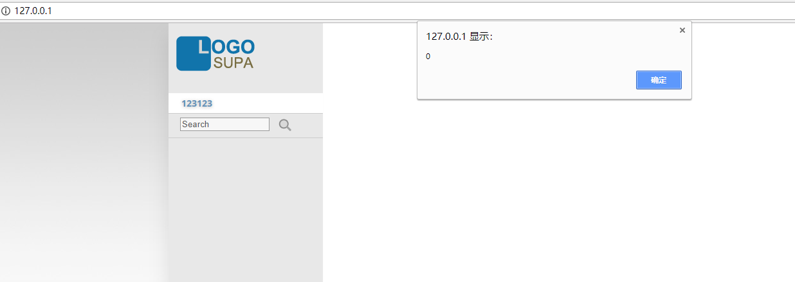

# wbcms xss vul CVE-2018-6313#

login admin page,in pages modify Page the content has xss vul.
use source mode , input xss paylaod `<img src=x onerorr=alert(0)`

 and save modify visit hompage,

there is a alert box.
