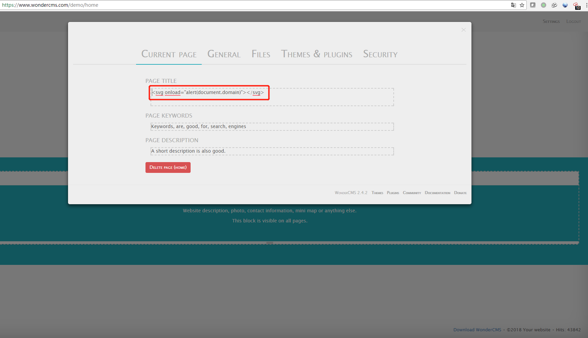
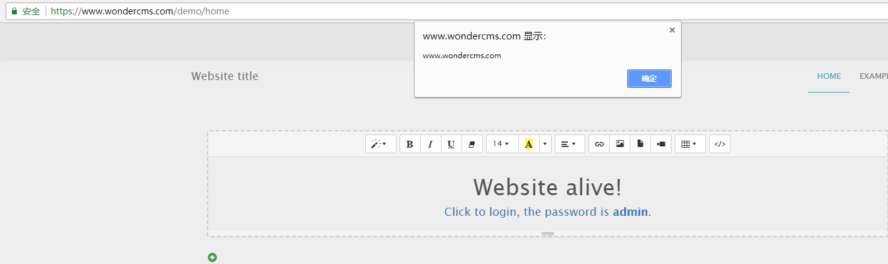

# WonderCMS Cross-Site Script# 

WonderCMS version 2.4.2 contains a Stored Cross-Site Scripting on Setting > title parameter

i was test on WonderCMS demo site https://www.wondercms.com/demo/home

in setting > title parameter input xss paylaod `<svg onload=alert(document.domain)></svg>`

next visite home page there is an alert box to show domain.

