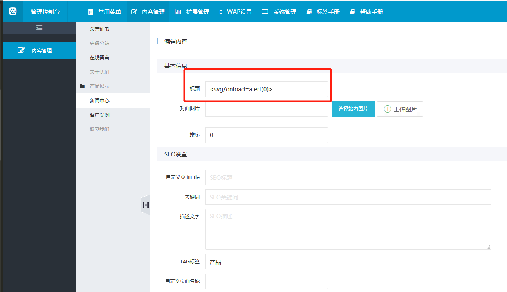
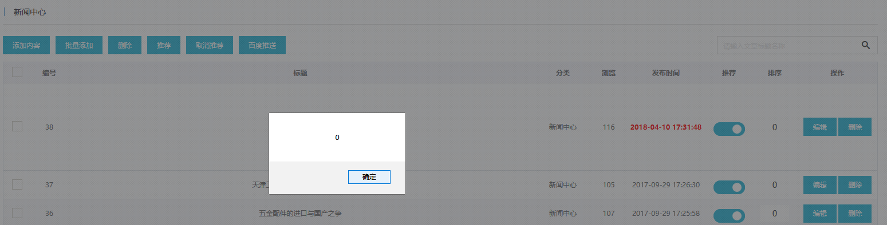
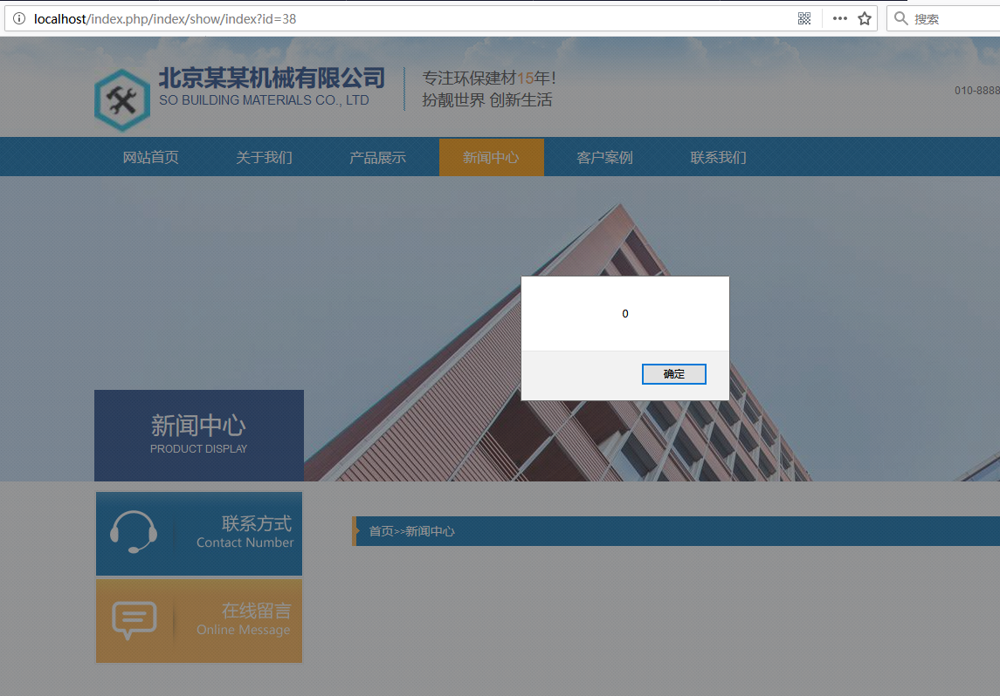

# yunucms 1.0.7 has xss vulnerability in news center page title parameter#

in login with admin and visit `http://localhost/index.php/admin/content/addcontent/cid/38` to add a new content.

in new content set content title to `<svg/onload=alert(0)>`,and  save it.

there is a alert box in newscenter content list.

then visite page `http://localhost/index.php/index/show/index?id=38` there is xss vulnerability.

